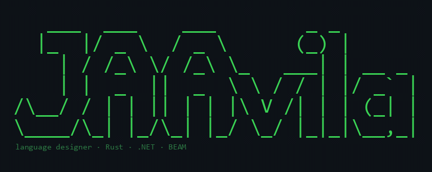
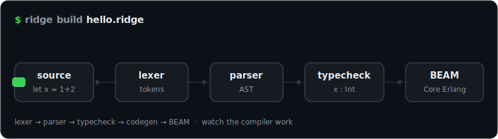
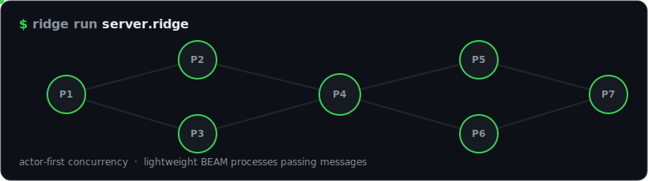
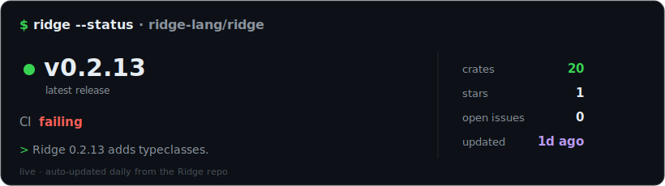

<!--
  ════════════════════════════════════════════════════════════════════
  README de PERFIL de GitHub — JAAvila-Of   ·   estilo: TERMINAL / HACKER
  Va en el repo público llamado EXACTAMENTE "JAAvila-Of".
  Aparece en https://github.com/JAAvila-Of
  Placeholders [ASÍ] => reemplázalos. Ver ../PUBLICAR.md y ../SETUP-WIDGETS.md
  Paleta: verde #39d353 (terminal) · morado #bb9af7 (Ridge) · fondo #0d1117
  ════════════════════════════════════════════════════════════════════
-->

<div align="center">

<!-- Banner ASCII art (figlet Doom) rasterizado + shimmer -->


<br/>

<!-- Terminal ANIMADA (SVG con CSS keyframes). Si no anima por proxy, usa la raw URL:
     https://raw.githubusercontent.com/JAAvila-Of/JAAvila-Of/main/assets/terminal.svg -->


<br/>


<p>
  
  <a href="https://github.com/JAAvila-Of?tab=followers"></a>
  
</p>

</div>

---

## `~/whoami`

```console
$ whoami
> Jóse Angel Avila  —  language designer & backend engineer  🦀

$ cat ./about.txt
> 🇪🇸 Creador de Ridge, un lenguaje funcional tipado para la BEAM (en Rust).
>    Me obsesionan los compiladores, los sistemas de tipos y el dev tooling.
> 🇬🇧 Creator of Ridge, a typed functional language for the BEAM (in Rust).
>    Obsessed with compilers, type systems and developer tooling.

$ cat ./affiliations.txt
> .NET Foundation  ·  member 💜
> ridge-lang       ·  founder 🦀

$ ridge --ask-me-about
> compilers · type systems · Rust · C#/.NET · the BEAM · auth
```

---

## `~/ridge --showcase`  🦀

> **[Ridge](https://github.com/ridge-lang/ridge)** — a typed functional language for the BEAM.
> Hindley-Milner inference · row polymorphism · actor-first concurrency · effects/capabilities tracked in the type system.

```haskell
-- A pure step of Conway's Game of Life, in Ridge.
import std.list as List

type Grid = { rows: Int, cols: Int, cells: List (List Bool) }

fn nextCell (grid: Grid) (r: Int) (c: Int) -> Bool =
    match (cellAt grid r c, liveNeighbours grid r c)
        (true,  2) -> true   -- survives
        (true,  3) -> true   -- survives
        (false, 3) -> true   -- born
        _          -> false  -- dies / stays dead
```

<div align="center">

<!-- Compilador en vivo — SVG animados (reemplazan el diagrama estático) -->






<sub><i>compiler pipeline · Hindley-Milner inference · actor-first concurrency — Core Erlang/BEAM 🟢, LLVM &amp; WASM exploratory</i></sub>

</div>

<div align="center">

<!-- Game of Life ASCII animado — corre uno de mis ejemplos de Ridge en vivo -->


<sub><i>☝️ <code>game_of_life.ridge</code> — a Gosper glider gun, evolving live.</i></sub>

</div>

---

## `~/stack --list`

<div align="center">
  
</div>

---

## `~/projects --pinned`

| Project | Description | Tech |
|---|---|---|
| 🦀 **[Ridge](https://github.com/ridge-lang/ridge)** ⭐ | Typed functional language for the BEAM. HM inference, row polymorphism, actor-first concurrency, capabilities in the type system. Compiles to Core Erlang/BEAM; native (LLVM) & WASM backends are exploratory. *(In active development.)* | Rust · BEAM |
| 🐙 **[agm-cli](https://github.com/JAAvila-Of/agm-cli)** | CLI & Rust library to parse, validate, render and orchestrate *Agent Graph Memory* (AGM) files for AI-agent workflows. Born out of the **Octopus** project. | Rust |
| 💜 **[JAAvila.FluentOperations](https://github.com/JAAvila-Of/JAAvila.FluentOperations)** | Large fluent **validation & assertive-testing** library for .NET — thread-safe, chained operations that unify inline `.Test()` assertions with model **Quality Blueprints**. 6,500+ tests; covers strings, numbers, dates, collections — even **architecture rules** (type & assembly). Integrations: DI, ASP.NET Core, Minimal API, MediatR, gRPC, OpenAPI & Roslyn analyzers. | C# / .NET |
| 🛡️ **[JAAvila.SafeTypes](https://github.com/JAAvila-Of/JAAvila.SafeTypes)** | My very **first** .NET library 💚 — lightweight type-safety utilities to dodge null-reference errors and enforce stricter, compile-time contracts (e.g. `source.SafeNull()`). Humble, but where the journey began. | C# / .NET |
| 💉 **[418Apps-COVID](https://github.com/JAAvila-Of/418Apps-COVID)** | COVID-19 vaccination tracker for Peru using official open data. | Svelte · TS |

---

## `~/stats --all`

<div align="center">




</div>

#### 📈 Activity

<div align="center">
  
</div>

#### ⚡ Project pulse — live

<div align="center">
  <!-- Pulse de Ridge — datos REALES, auto-actualizado por pulse.yml -->
  
</div>

---

## `~/now-playing`  🎧

<div align="center">
  <!-- SPOTIFY: reemplaza 31lwszpsc3lnbnvzdtflhmvz65ei por tu uid (login en spotify-github-profile.kittinanx.com). Ver ../SETUP-WIDGETS.md -->
  <a href="https://open.spotify.com/user/31lwszpsc3lnbnvzdtflhmvz65ei">
    
  </a>
</div>

---

## `~/connect`

<div align="center">

<a href="https://www.linkedin.com/in/jaavila418"></a>
<a href="mailto:jaavila.dev@outlook.com"></a>
<a href="https://github.com/ridge-lang/ridge"></a>
<!-- Opcionales: descomenta los que uses
<a href="[TU-WEB]"></a>
<a href="[TU-X]"></a>
-->

</div>

```console
$ echo "Thanks for visiting!  ·  ¡Gracias por pasar!"
> ⭐ Star Ridge if you like it: github.com/ridge-lang/ridge
> _
```

<!-- Voronoi dinámico como franja de cierre -->

